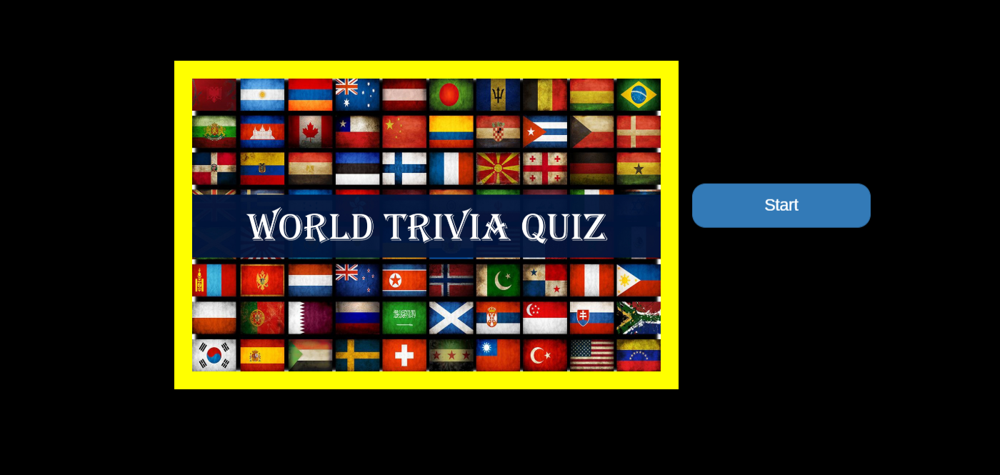

# TriviaGame

## Overview
This is a homework project for Georgia Tech Full Stack Web Developement Bootcamp.It is a simple multiple choice trivia game created using `HTML`,`CSS` and `jQuery`.Quize is themed as National Geographic quize.  

### Live Demo
---
[Play the game](https://pshegde123.github.io/TriviaGame.github.io/)

### Getting Started
---
(1) Clone this repository

(2) Change directory to TriviaGame

(3) In your browser open file index.html
